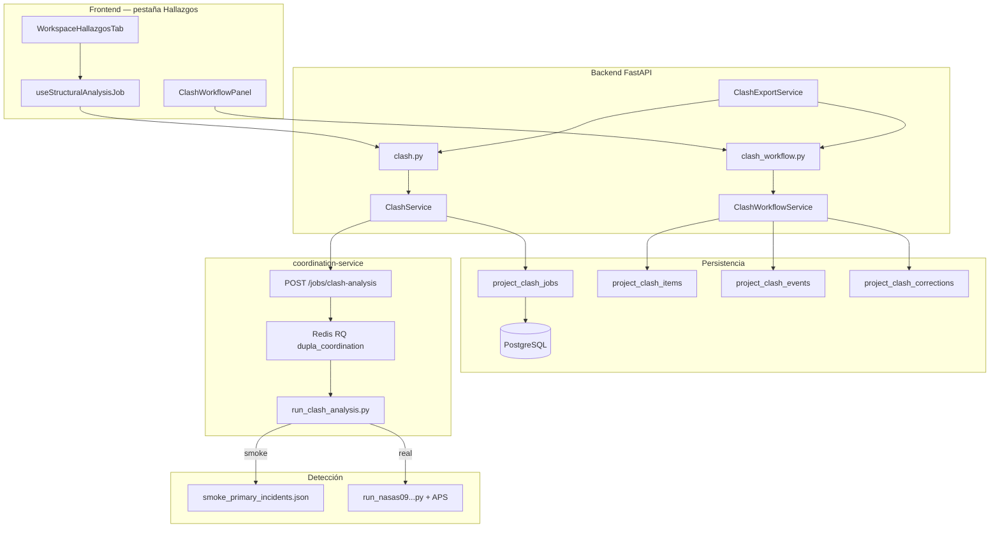
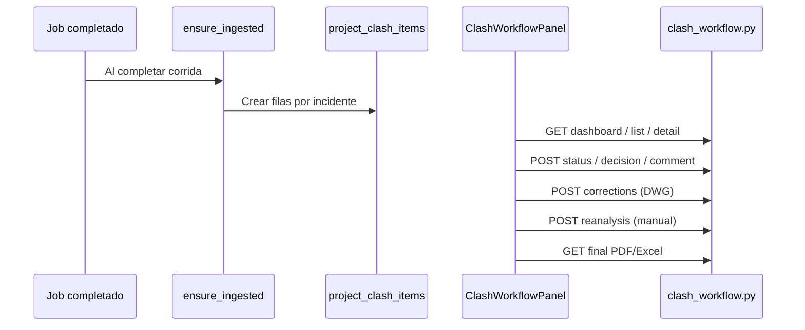

# Informe de estado funcional — Módulo de Clashes (Dupla)

| Campo | Valor |
|-------|-------|
| **Fecha** | 18 de junio de 2026 |
| **Alcance** | Exclusivamente detección de clashes, coordinación, workflow de hallazgos y exportaciones asociadas |
| **Base del audit** | Código en rama `develop` tras merge PR #4 (`feat/clashes-integration`, commit `88e1233`) |
| **Metodología de %** | Estimación cualitativa implementación vs. gaps (no LOC ni cobertura formal) |
| **Última revisión** | 18 de junio de 2026 — audit post-arranque Docker y merge migración 040 |
| **Commit base** | develop @ 88e1233 (PR #4 feat/clashes-integration) |


---

## Notas de revisión — 18 de junio de 2026

Verificaciones realizadas en esta fecha:

| Verificación | Resultado |
|--------------|-----------|
| Rama local | `develop` sincronizada con `liljemery/develop` (`88e1233`) |
| Docker stack `dupla` | Levantado (frontend :5173, backend :8000, processor :8001, coordination :8002) |
| Migraciones clash | Aplicadas incl. merge `040_merge_heads` (resuelve doble head 033–035) |
| `COORDINATION_SMOKE_MODE` | Sigue en `"true"` — detección geométrica **simulada** |
| Bug `ClashWorkflowService` | **Persiste** — `workspace_id` no pasado al constructor |
| Código clash desde 14-jun | Sin commits nuevos en clashes tras PR #4 |

Los porcentajes y conclusiones del informe se mantienen válidos; la fecha de auditoría se actualiza a hoy.


---

## 1. Resumen ejecutivo

El módulo de **clashes** en Dupla es un subsistema de tres capas:

1. **Detección** — microservicio `coordination-service` + motor geométrico 2.5D (externo al repo).
2. **Orquestación** — backend `ClashService` + jobs en PostgreSQL + cola Redis/RQ.
3. **Workflow post-detección** (PR #4) — API y UI para revisar, decidir, corregir y exportar informes finales.

### Veredicto global del módulo clashes: **~62% de completitud**

Escala: **0** = sin implementar · **100** = detección real en producción + workflow completo + reanálisis automático.

| Dimensión | % | Estado |
|-----------|---|--------|
| Orquestación de jobs (enqueue, poll, persistencia) | **~88%** | Óptima |
| Detección geométrica (motor 2.5D) | **~32%** | **Simulada** en Docker |
| Informes de corrida (PDF/Excel técnico) | **~78%** | Mediana |
| Workflow en vivo (DB + API + UI) | **~55%** | Mediana con **bug crítico** |
| Correcciones y reanálisis | **~40%** | Parcial / simulado |
| Exportaciones finales (PDF/Excel enriquecido) | **~65%** | Mediana |
| Tiles SVG / vista de planta | **~50%** | Smoke / placeholder |
| Tests automatizados | **~28%** | Débil |

### Respuestas directas

| Pregunta | Respuesta |
|----------|-----------|
| ¿La detección de clashes funciona correctamente? | **No en Docker por defecto** — está **simulada** (`COORDINATION_SMOKE_MODE=true`). La orquestación es real; la geometría devuelve fixtures. |
| ¿El workflow de hallazgos (PR #4) funciona? | **Parcialmente** — UI y API implementados, pero hay un **bug crítico** de `workspace_id` que probablemente rompe el panel en vivo. |
| ¿El presupuesto está relacionado? | **No** — presupuesto usa `processor/` de forma independiente. Ver sección 12. |
| ¿APIs externas de clashes OK? | **Condicional** — Redis y coordination-service sí; APS solo en modo real (no activo por defecto). |

---

## 2. Arquitectura funcional (solo clashes)



### Carpetas principales

| Capa | Ruta | Rol |
|------|------|-----|
| Microservicio | `coordination-service/` | Jobs de análisis, smoke/real, mapeo de informe |
| Backend API | `backend/app/routes/clash.py` | Jobs, inventario, informe estructural, PDF corrida |
| Backend workflow | `backend/app/routes/clash_workflow.py` | Dashboard, decisiones, correcciones, exports finales |
| Servicios | `backend/app/services/clash_*.py` | Orquestación, workflow, exports, tiles |
| PDF/Excel | `backend/app/services/clash_reports/` | Informes técnico, humano, coordinación, final |
| Modelos | `backend/app/models/project_clash_*.py` | Jobs, items, events, corrections |
| Dominio | `backend/app/domain/clash_workflow_enums.py` | Estados, decisiones, transiciones |
| Frontend UI | `frontend/src/components/.../WorkspaceHallazgosTab.tsx` | Pestaña Hallazgos |
| Frontend workflow | `frontend/src/components/clash-workflow/ClashWorkflowPanel.tsx` | Panel workflow en vivo |
| Cliente API | `frontend/src/api/structuralAnalysis.ts`, `clashWorkflow.ts` | HTTP |
| Migraciones | `backend/alembic/versions/031–035, 040` | Schema clash + merge heads |
| Datos offline | `analysis_output/`, `repositorios/*/coordination/` | Corridas históricas reales |
| Guía revisión | `docs/MAPA_CLASHES.md` | Mapa de archivos para revisores |

---

## 3. Etapas del módulo clashes y % de desarrollo

| Etapa / componente | % dev | Calidad | Notas |
|--------------------|-------|---------|-------|
| Selección de carpeta + inventario pre-flight | **90%** | Óptima | `GET /coordination/inventory`, validación disciplinas |
| Encolado y polling de jobs | **88%** | Óptima | `ClashService` → coordination-service → Redis |
| Persistencia de resultados (JSONB) | **85%** | Óptima | `project_clash_jobs` |
| **Detección geométrica 2.5D** | **32%** | **Simulada** | Smoke por defecto; runner ausente del repo |
| Informe estructural en UI (Hallazgos) | **82%** | Óptima / mediana | Datos reales de pipeline; contenido smoke en Docker |
| PDF corrida técnico | **80%** | Mediana | Tests unitarios |
| PDF corrida humano/arquitecto | **72%** | Mediana | Depende de workflow service |
| Excel corrida técnico | **75%** | Mediana | `clash_excel_export.py` |
| Ingesta automática a workflow DB | **70%** | Mediana | `ensure_ingested` — falla silenciosa si workflow roto |
| Schema workflow (items, events, corrections) | **92%** | Óptima | Migraciones 033–035 |
| API workflow (dashboard, status, decision) | **60%** | Mediana | **Bug `workspace_id`** |
| UI workflow en vivo (`ClashWorkflowPanel`) | **65%** | Mediana | Implementada; bloqueada por API |
| Upload de correcciones DWG | **68%** | Mediana | Almacena archivo; no re-ejecuta detección |
| Reanálisis | **25%** | **Simulado** | Usuario elige resultado manual; sin nuevo job |
| PDF/Excel final (workflow enriquecido) | **65%** | Mediana | `final_pdf.py`, rutas en `clash_workflow.py` |
| Tiles SVG (vista planta) | **50%** | Smoke / placeholder | No geometría DWG real en demo |
| Asignación de revisor | **40%** | Parcial | API existe; UI no conectada |
| Tests E2E / integración | **20%** | Débil | Solo unitarios de formato/PDF |
| Motor runner + APS en repo | **25%** | Ausente / externo | Script no versionado |

---

## 4. Features: funcionando vs. no funcionando

### 4.1 Funcionando correctamente (óptimo / mediano real)

| Feature | Evidencia |
|---------|-----------|
| Listado de carpetas para coordinación | `GET /coordination/folders` |
| Inventario pre-flight (DWG + ≥2 disciplinas) | `ClashService.get_coordination_inventory` |
| Encolar job de clash | `POST /clash/jobs` → coordination-service |
| Polling de estado cada 5s | `useStructuralAnalysisJob.ts` |
| Guardar resultado en `project_clash_jobs` | `sync_job_status` |
| Mostrar informe en pestaña Hallazgos | `GET /structural-analysis-report` |
| Export PDF corrida técnico | `GET .../exports/technical.pdf` |
| Cola Redis `dupla_coordination` | `coordination-service/worker.py` |
| Health check coordination | `GET /health` en `:8002` |
| Migraciones clash aplicables (con merge 040) | `040_merge_clash_and_workspace_heads.py` |

### 4.2 Parcialmente funcionales

| Feature | Limitación |
|---------|------------|
| **Workflow en vivo** | `ClashWorkflowService` no pasa `workspace_id` a `ClashService` |
| **PDF corrida humano** | Usa workflow service con el mismo bug |
| **Export final PDF/Excel** | Rutas en `clash_workflow.py` sin `get_workspace_context` |
| **Ingesta post-job** | `ensure_ingested` en try/except — error silenciado |
| **Correcciones DWG** | Solo guarda archivo; no compara geometría |
| **Tiles SVG** | Smoke dibuja bounding boxes, no linework DWG |
| **Perfiles tortuga/serena/nasas** | `coordinationProfiles.ts` huérfano; se usa perfil `folder` |
| **Hallazgos manuales** | Conviven en la misma pestaña pero son CRUD separado (`technical-findings`) |

### 4.3 Simulados / no funcionales

| Feature | Motivo |
|---------|--------|
| **Detección geométrica en Docker** | `COORDINATION_SMOKE_MODE: "true"` → fixture JSON |
| **Reanálisis automático** | `request_reanalysis` solo actualiza estado manual |
| **Runner 2.5D** | `coordination/scripts/run_nasas09_project_coordination.py` ausente |
| **IFC/BIM en clashes** | Upload permitido en proyecto; pipeline solo DWG/DXF |
| **Mock frontend** | `mockStructuralAnalysisReport.ts` no importado (legacy) |
| **Asignar revisor desde UI** | `POST /assign` sin cliente en `clashWorkflow.ts` |
| **APS en modo demo** | No se invoca sin `COORDINATION_SMOKE_MODE=false` + runner |

---

## 5. Detección de clashes: ¿real o simulada?

### Veredicto: **HÍBRIDO — orquestación real, geometría SIMULADA por defecto**

| Capa | Estado |
|------|--------|
| UI → API → cola → DB → informe | **REAL** |
| Algoritmo 2.5D (intersección plana + solape Z) | **SIMULADO en Docker** |
| Modo real (APS + runner) | **Existe en código** pero no activo ni versionado |

### Evidencia

Docker Compose (líneas 114 y 137):

```yaml
COORDINATION_SMOKE_MODE: "true"
```

Wrapper de detección:

```147:160:coordination-service/wrapper/run_clash_analysis.py
    smoke_mode = os.getenv("COORDINATION_SMOKE_MODE", "").lower() in ("1", "true", "yes")
    if smoke_mode:
        primary = _smoke_primary_incidents(profile_slug, project_name, file_entries)
    else:
        _invoke_runner(...)
```

En modo smoke:
- Datos de `coordination-service/fixtures/smoke_primary_incidents.json`
- Tiles SVG sintéticos con etiqueta `"vista de planta (smoke)"`
- Sin llamada a APS ni al runner externo

Para activar detección **real**:
1. `COORDINATION_SMOKE_MODE=false`
2. Script runner presente en `DUPLA_ROOT/coordination/scripts/`
3. Credenciales APS (`CLIENT_ID`, `CLIENT_SECRET`)
4. ≥2 disciplinas DWG clasificadas en la carpeta seleccionada

---

## 6. Workflow en vivo (PR #4 — feat/clashes-integration)

### Qué añadió el PR

| Componente | Archivos clave |
|------------|----------------|
| Schema DB | `033_project_clash_workflow.py`, `034_project_clash_corrections.py`, `035_clash_job_export_revisions.py` |
| API REST | `backend/app/routes/clash_workflow.py` (12+ endpoints) |
| Lógica | `backend/app/services/clash_workflow_service.py` (~900 líneas) |
| UI | `ClashWorkflowPanel.tsx` embebido en `WorkspaceHallazgosTab` |
| Exports finales | `final_pdf.py`, `coordination_report_pdf.py`, `observations_plan_pdf.py` |
| Excel | `clash_excel_export.py` |

### Flujo del workflow



### Estado del workflow: **~55% — implementado pero con bloqueador**

El panel `ClashWorkflowPanel` carga dashboard, tabla filtrable, drawer de detalle, decisiones, comentarios y sección de correcciones. Sin embargo:

```133:137:backend/app/services/clash_workflow_service.py
class ClashWorkflowService:
    def __init__(self, session: AsyncSession) -> None:
        self._session = session
        self._clash_svc = ClashService(session)      # ← falta workspace_id
        self._project_svc = ProjectService(session)  # ← falta workspace_id
```

`ClashService` requiere `(session, workspace_id: UUID)`. Esto provoca `TypeError` al instanciar el workflow service. Las rutas en `clash_workflow.py` tampoco usan `get_workspace_context` (a diferencia de `clash.py`).

La ingesta automática falla en silencio:

```494:500:backend/app/services/clash_service.py
            try:
                wf = ClashWorkflowService(self._session)
                await wf.ensure_ingested(job, actor="system")
            except Exception as exc:
                logger.warning("Clash workflow ingest after job complete failed: %s", exc)
```

---

## 7. APIs y servicios externos (solo clashes)

| Servicio | ¿Usado? | ¿Funciona? | Notas |
|----------|---------|------------|-------|
| **coordination-service** (HTTP interno) | Sí | Sí | `COORDINATION_URL`, puerto 8002 |
| **Redis + RQ** | Sí (indirecto) | Sí | Cola `dupla_coordination` |
| **PostgreSQL** | Sí | Sí | Jobs, items, events, corrections |
| **Autodesk APS** | Solo modo real | Condicional | `--dwg-via-aps` en runner; inactivo en smoke |
| **Filesystem local** | Sí | Sí | DWGs del proyecto, tiles, correcciones |
| **OpenAI** | No | — | No participa en clashes |
| **SMTP** | No | — | No participa en clashes |

**No integradas en clashes:** Forge viewer, IFC parser, Supabase, S3.

---

## 8. Errores graves

### Prioridad ALTA

| # | Error | Impacto | Ubicación |
|---|-------|---------|-----------|
| 1 | Detección simulada por defecto | Usuarios ven interferencias ficticias como reales | `docker-compose.yml:114,137` |
| 2 | `ClashWorkflowService` sin `workspace_id` | Workflow API y panel en vivo probablemente rotos | `clash_workflow_service.py:136-137` |
| 3 | `clash_workflow.py` sin `get_workspace_context` | Inconsistencia de tenancy vs. `clash.py` | `clash_workflow.py` |
| 4 | Motor runner ausente del repo | Imposible detección real sin setup externo | `coordination/scripts/` |
| 5 | Ingesta workflow falla en silencio | Jobs completan pero no crean filas de workflow | `clash_service.py:494-500` |

### Prioridad MEDIA

| # | Error | Impacto |
|---|-------|---------|
| 6 | Reanálisis manual, no automático | Expectativa de re-detección incumplida |
| 7 | Correcciones no disparan nuevo job | DWG corregido no se analiza |
| 8 | Tiles SVG son placeholders | Sin vista real de geometría en demo |
| 9 | `coordinationProfiles.ts` huérfano | Perfiles por edificio no usados |
| 10 | Migraciones con heads duplicados (033–035) | Confusión; resuelto localmente con `040_merge` |
| 11 | Sin tests de workflow API | Regresiones no detectadas |

### Prioridad BAJA

| # | Error | Impacto |
|---|-------|---------|
| 12 | `POST /assign` sin UI | Asignación solo vía API directa |
| 13 | `downloadFinalTechnicalPdf` sin botón en UI | Export disponible en API, no expuesto |
| 14 | Mock `mockStructuralAnalysisReport.ts` sin eliminar | Confusión de mantenimiento |

---

## 9. Cobertura de pruebas (clashes)

| Archivo | Qué cubre | Qué NO cubre |
|---------|-----------|--------------|
| `test_clash_exports.py` | PDF builders, fingerprints, filenames | Workflow API, HTTP |
| `test_clash_report_normalize.py` | Normalización incidentes | Detección geométrica |
| `test_clash_report_formatting.py` | Severidad, zoom | Integration |
| **coordination-service/** | — | **0 tests** |
| **frontend/** | — | **0 tests** de clashes |

No hay tests E2E: enqueue → coordination → workflow ingest → UI.

---

## 10. Endpoints API del módulo clashes

### Corrida (detección)

| Método | Ruta |
|--------|------|
| GET | `/api/projects/{uuid}/coordination/folders` |
| GET | `/api/projects/{uuid}/coordination/inventory` |
| POST | `/api/projects/{uuid}/clash/jobs` |
| GET | `/api/projects/{uuid}/clash/jobs/latest` |
| GET | `/api/projects/{uuid}/structural-analysis-report` |
| GET | `/api/projects/{uuid}/clash/jobs/latest/exports/technical.pdf` |
| GET | `/api/projects/{uuid}/clash/jobs/latest/exports/human.pdf` |

### Workflow (PR #4)

| Método | Ruta |
|--------|------|
| GET | `/api/projects/{uuid}/clash-workflow/dashboard` |
| GET | `/api/projects/{uuid}/clash-workflow/filters` |
| GET | `/api/projects/{uuid}/clash-workflow/clashes` |
| GET | `/api/projects/{uuid}/clash-workflow/clashes/{id}` |
| POST | `/api/projects/{uuid}/clash-workflow/status` |
| POST | `/api/projects/{uuid}/clash-workflow/decision` |
| POST | `/api/projects/{uuid}/clash-workflow/assign` |
| POST | `/api/projects/{uuid}/clash-workflow/comment` |
| POST | `/api/projects/{uuid}/clash-workflow/corrections` |
| POST | `/api/projects/{uuid}/clash-workflow/reanalysis` |
| GET | `/api/projects/{uuid}/clash-workflow/tiles/{filename}` |
| GET | `/api/projects/{uuid}/clash-workflow/exports/final-*.pdf/xlsx` |

### Microservicio interno

| Método | Ruta |
|--------|------|
| POST | `http://coordination-service:8000/jobs/clash-analysis` |
| GET | `http://coordination-service:8000/jobs/{id}` |
| GET | `http://coordination-service:8000/health` |

---

## 11. Variables de entorno (clashes)

| Variable | Servicio | Efecto |
|----------|----------|--------|
| `COORDINATION_URL` | Backend | URL del microservicio (default `http://coordination-service:8000`) |
| `COORDINATION_SMOKE_MODE` | Coordination | **`"true"` = simulación** (default Docker) |
| `DUPLA_ROOT` | Coordination | Montaje del repo para runner externo |
| `COORDINATION_OUTPUT_ROOT` | Coordination | Salida de artefactos por job |
| `REDIS_URL` | Coordination | Cola RQ |
| `CLIENT_ID` / `CLIENT_SECRET` | Runner (modo real) | APS para extracción DWG |
| `UPLOAD_ROOT` | Backend | DWGs del proyecto + correcciones |

---

## 12. Presupuestos (alcance limitado)

El módulo de **presupuestos** (`processor/`, pestaña Presupuesto maestro) es **independiente** de clashes. No comparte código de detección ni workflow.

| Aspecto | Estado | Relación con clashes |
|---------|--------|----------------------|
| Pipeline presupuesto IA | Real (processor) | Ninguna |
| Usa mismos DWG del proyecto | Sí | Archivos compartidos en `project_files` |
| Usa APS | Sí (processor) | APS en clashes solo vía runner externo |

**Conclusión:** la función de presupuestos no afecta ni depende del módulo clashes. Su evaluación completa está fuera del alcance de este informe.

---

## 13. Recomendaciones priorizadas

### Urgente

1. **Corregir `ClashWorkflowService`** — pasar `workspace_id` y usar `get_workspace_context` en `clash_workflow.py`.
2. **Documentar en UI** que la corrida está en modo demo cuando `COORDINATION_SMOKE_MODE=true`.
3. **Incorporar el runner** `run_nasas09_project_coordination.py` al repositorio.

### Corto plazo

4. Hacer visible el fallo de ingesta (no silenciar el `except` en `ensure_ingested`).
5. Conectar `POST /assign` en el frontend.
6. Tests de integración para workflow API.
7. Commitear `040_merge_clash_and_workspace_heads.py` upstream.

### Medio plazo

8. Reanálisis real: encolar nuevo job coordination tras subir corrección.
9. Activar detección real en staging (`COORDINATION_SMOKE_MODE=false`).
10. Eliminar mocks y perfiles huérfanos.

---

## 14. Conclusiones

| Pregunta | Respuesta |
|----------|-----------|
| ¿% del módulo clashes completado? | **~62%** |
| ¿Detección funciona? | **Simulada en Docker**; orquestación real |
| ¿Workflow PR #4 funciona? | **Parcial** — bug `workspace_id` bloquea API |
| ¿APIs externas OK? | Redis + coordination sí; APS solo en modo real |
| ¿Qué está óptimo? | Jobs, inventario, polling, informe corrida, schema DB |
| ¿Qué está simulado? | Geometría, tiles, reanálisis |
| ¿Qué falta para 100%? | Runner en repo, smoke off, fix workflow, reanálisis real, tests E2E |

---

## 15. Documentación relacionada

| Documento | Contenido |
|-----------|-----------|
| `docs/MAPA_CLASHES.md` | Mapa de archivos y carpetas para revisores |
| `docs/INFORME_ESTADO_PROYECTO.md` | Audit general del proyecto (incluye clashes) |

---

*Informe generado por audit de código fuente. Enfocado exclusivamente en el módulo de clashes y coordinación.*
