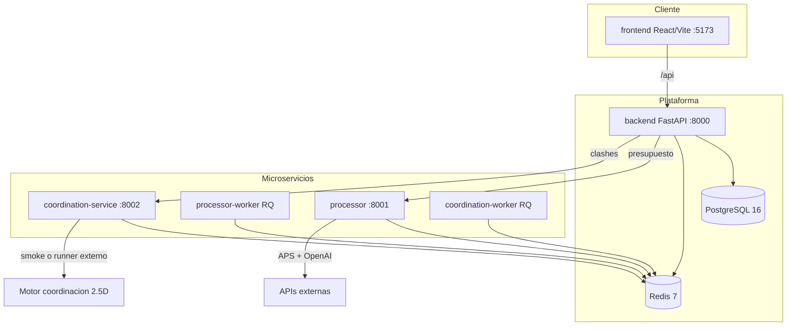
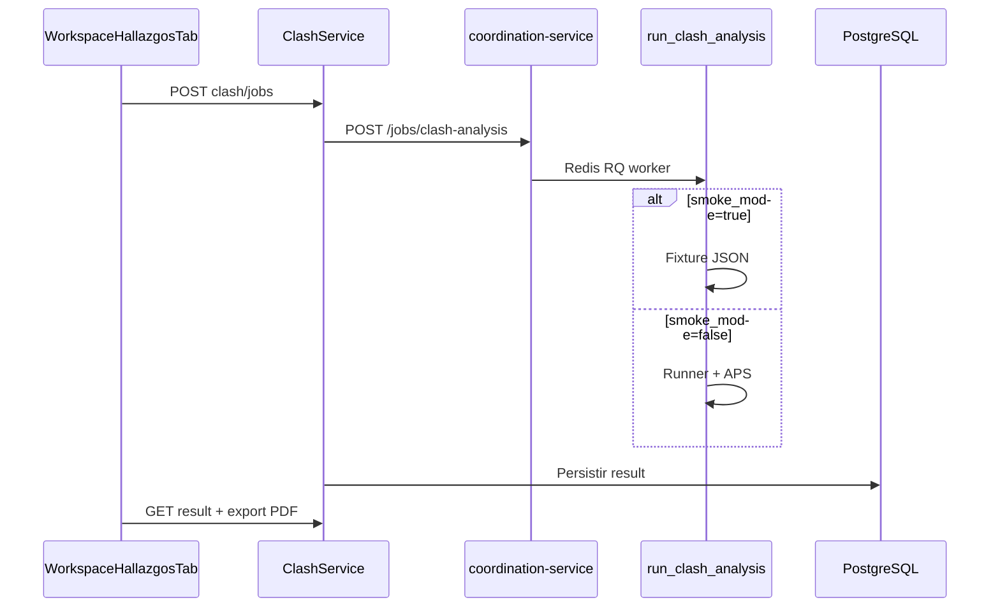
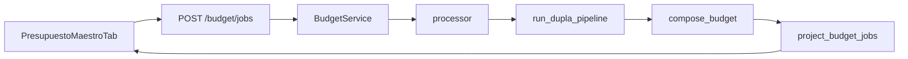

# Informe de estado funcional — Grupo Dupla

| Campo | Valor |
|-------|-------|
| **Fecha del informe** | 14 de junio de 2026 |
| **Repositorio** | Monorepo Dupla (`backend`, `frontend`, `processor`, `coordination-service`) |
| **Alcance del audit** | Código fuente, configuración Docker, tests existentes, artefactos en `analysis_output/` |
| **Metodología de porcentajes** | Estimación cualitativa basada en implementación vs. gaps documentados (no métricas de LOC ni cobertura formal) |

---

## 1. Resumen ejecutivo

**Dupla** es una plataforma web de gestión de obras y proyectos de arquitectura para equipos internos. Reúne ciclo de vida del proyecto, repositorio documental (DWG/DXF/PDF), colaboración (chat, Kanban), presupuesto automatizado con IA y detección de interferencias (clashes) entre disciplinas.

### Veredicto global: **~58% de completitud**

Escala: **0** = sin implementar · **100** = producto production-ready con presupuesto IA y clashes reales integrados de punta a punta.

| Dimensión | % estimado | Estado operativo |
|-----------|------------|------------------|
| Plataforma core (auth, proyectos, flujo, archivos, chat, tareas) | **~85%** | Óptima / mediana |
| Presupuesto IA (processor + UI Presupuesto maestro) | **~62%** | Real con gaps importantes |
| Detección de clashes | **~38%** | **Simulada por defecto** en Docker |
| Integraciones externas (OpenAI, APS, SMTP) | **~65%** | Condicionales a credenciales |
| Calidad / tests / CI | **~30%** | Débil |

### Hallazgos críticos

1. **La detección de clashes está simulada en el entorno Docker por defecto** (`COORDINATION_SMOKE_MODE=true`). La orquestación (UI → API → cola Redis → informes PDF) es real; la geometría de detección devuelve fixtures.
2. **El presupuesto maestro es funcional de verdad** (pipeline APS + Vision + BC3/APU), pero la base de precios del proyecto **no se conecta** al processor y hay bloqueadores documentados para presupuestos finales de calidad.
3. **El motor geométrico de coordinación no está en el repositorio**; el script runner externo es obligatorio para clashes reales.
4. **No hay CI/CD** (sin `.github/workflows`) ni tests E2E de presupuesto/clash.

---

## 2. Arquitectura funcional

### 2.1 Diagrama de componentes



### 2.2 Servicios y responsabilidades

| Componente | Ruta | Puerto (Docker) | Función principal |
|------------|------|-----------------|-------------------|
| **Backend API** | `backend/` | 8000 | Auth JWT, proyectos, flujo, chat, tareas, jobs presupuesto/clash |
| **Frontend SPA** | `frontend/` | 5173 | Workspace multi-pestaña, chat, tablero Kanban, tutoriales |
| **Processor** | `processor/` | 8001 | Pipeline CAD/PDF → cantidades → BC3/Excel |
| **Coordination service** | `coordination-service/` | 8002 | Jobs de análisis estructural / clashes |
| **PostgreSQL** | contenedor | 5432 | Persistencia (39 migraciones Alembic) |
| **Redis** | contenedor | 6379 | Caché, epoch chat, colas RQ |

### 2.3 Stack tecnológico

| Capa | Tecnología |
|------|------------|
| API | FastAPI 0.115, SQLAlchemy async, Alembic, Pydantic 2.x |
| Datos | PostgreSQL 16 |
| Caché / colas | Redis 7, RQ |
| Auth | JWT (`python-jose`, bcrypt) |
| Frontend | React 19, Vite 8, TypeScript 5.9, Tailwind 4, Zustand, Zod |
| IA | OpenAI (clasificación, asistente, vision en processor) |
| CAD | Autodesk APS (Model Derivative, OSS) |
| Export | openpyxl (GA-FO), BC3/FIEBDC, Excel presupuesto |

### 2.4 Roles de usuario

| Rol | Código | Capacidades principales |
|-----|--------|-------------------------|
| Gerencia | `GERENCIA` | Admin usuarios, dashboard KPIs, visión global |
| Control | `CONTROL` | Coordinación proyectos, chat, tablero, presupuesto |
| Presupuesto | `PRESUPUESTO` | Operación proyecto, presupuesto maestro |
| Arquitectura | `ARQUITECTURA` | Proyectos y archivos; **sin acceso a pestañas de presupuesto** |

---

## 3. Mapa de módulos y workspace

### 3.1 Pestañas del workspace de proyecto

Definidas en `frontend/src/constants/projectWorkspaceTabs.ts`:

| ID pestaña | Etiqueta UI | Componente principal | Estado |
|------------|-------------|----------------------|--------|
| `hub` | Inicio | Rejilla de acceso rápido | Óptimo |
| `detalles` | Detalles | Metadatos del proyecto | Óptimo |
| `flujo` | Arranque y flujo | Fases, checklist, subcontratos | Óptimo / mediano |
| `archivos` | Archivos | Carpetas, subida, búsqueda | Óptimo |
| `basePrecios` | Base de precios | Upload + clasificación IA | Mediano (desconectado) |
| `entregaPlanos` | Control de entregas | Entregas de planos | Óptimo |
| `revisiones` | Revisiones | Revisión arquitectónica | Óptimo |
| `hallazgos` | Hallazgos | Detección clashes | **Simulado** (Docker) |
| `pliego` | Pliego | GA-FO, especificaciones | Mediano |
| `presupuestoMaestro` | Presupuesto maestro | Pipeline IA presupuesto | Mediano (real) |
| `eventos` | Eventos | Auditoría paginada | Óptimo |

Las pestañas `basePrecios` y `presupuestoMaestro` están ocultas para el rol `ARQUITECTURA`.

### 3.2 Fases del ciclo de vida (workflow)

Definidas en `backend/app/domain/workflow_phase.py`:

```6:28:backend/app/domain/workflow_phase.py
class WorkflowPhase(StrEnum):
    BOOTSTRAPPING = "BOOTSTRAPPING"
    AWAITING_FILES = "AWAITING_FILES"
    ARCHITECTURE_REVIEW = "ARCHITECTURE_REVIEW"
    SPECIFICATIONS = "SPECIFICATIONS"
    BUDGETING_PIPELINE = "BUDGETING_PIPELINE"
    MANAGEMENT_APPROVAL = "MANAGEMENT_APPROVAL"
    BUDGET_APPROVED = "BUDGET_APPROVED"
    COMPLETE = "COMPLETE"
    CUSTOM_AUTOMATION = "CUSTOM_AUTOMATION"

LINEAR_NEXT: dict[WorkflowPhase, WorkflowPhase] = {
    WorkflowPhase.BOOTSTRAPPING: WorkflowPhase.AWAITING_FILES,
    WorkflowPhase.AWAITING_FILES: WorkflowPhase.ARCHITECTURE_REVIEW,
    WorkflowPhase.ARCHITECTURE_REVIEW: WorkflowPhase.SPECIFICATIONS,
    WorkflowPhase.SPECIFICATIONS: WorkflowPhase.BUDGETING_PIPELINE,
    WorkflowPhase.BUDGETING_PIPELINE: WorkflowPhase.MANAGEMENT_APPROVAL,
    WorkflowPhase.MANAGEMENT_APPROVAL: WorkflowPhase.BUDGET_APPROVED,
    WorkflowPhase.BUDGET_APPROVED: WorkflowPhase.COMPLETE,
}
```

**Sub-pasos del pipeline de presupuesto** (dentro de `workflow_meta.budget_pipeline`):

- `subcontracts_done` — cotizaciones de subcontratos
- `volumetry_done` — volumetría
- `cost_analysis_done` — análisis de costo
- `budget_marked_complete` — presupuesto marcado completo
- `control_review_done` — revisión de Control
- `client_approved_version_label` — versión aprobada por cliente

---

## 4. Estado por etapa y módulo (% de desarrollo)

Leyenda de calidad operativa:

- **Óptima**: funcional de punta a punta con datos reales; listo para uso interno
- **Mediana**: funcional con limitaciones conocidas o dependencias externas
- **Simulada**: devuelve datos ficticios o requiere configuración no presente por defecto
- **Débil**: implementación incompleta o sin tests

| Etapa / Módulo | % dev | Calidad | Notas |
|----------------|-------|---------|-------|
| Autenticación y roles (JWT, reset password) | **95%** | Óptima | SMTP opcional; sin email en demo |
| Admin usuarios / workspaces / dashboard | **82%** | Óptima | KPIs Gerencia operativos |
| Proyectos y ciclo de vida (8 fases) | **85%** | Óptima | Guards en `project_lifecycle_service.py` |
| Archivos, carpetas, subida wizard | **85%** | Óptima | Paginación, búsqueda, clasificación IA |
| Chat (general, directo, grupo, epoch Redis) | **85%** | Óptima | Sincronización real |
| Tablero Kanban | **85%** | Óptima | Comentarios, archivar, eliminar |
| Pliego / GA-FO / especificaciones | **78%** | Mediana | Excel 1:1 + APS opcional |
| Base de precios (upload + IA) | **55%** | Mediana | **No conectada al processor** |
| Pipeline manual de presupuesto (Flujo tab) | **75%** | Mediana | Checkboxes + subcontratos; sin cálculo IA |
| Presupuesto maestro (IA) | **62%** | Mediana | Pipeline real; gaps de pricing |
| Hallazgos / detección clashes | **38%** | **Simulada** | Smoke mode por defecto |
| Asistente Dupla (OpenAI) | **70%** | Mediana | Requiere `OPENAI_API_KEY` |
| Tutoriales / UI | **80%** | Óptima | Recorridos in-app |
| Processor CAD (APS + Vision + BC3) | **58%** | Mediana | Fase 1/2; quantifiers incompletos |
| Motor coordinación (geometría 2.5D) | **25%** | Simulada/ausente | Runner **no está en el repo** |
| Tests E2E / CI | **30%** | Débil | Sin GitHub Actions |

---

## 5. Features: funcionando vs. no funcionando

### 5.1 Funcionando correctamente (óptimo / mediano real)

| Feature | Evidencia |
|---------|-----------|
| Login JWT, roles, cambio de contraseña | `backend/app/routes/auth.py` |
| CRUD proyectos, workspace multi-pestaña | `backend/app/routes/projects.py`, `ProjectWorkspacePage.tsx` |
| Transiciones de fase con reglas de dominio | `project_lifecycle_service.py` |
| Subida DWG/DXF/PDF con carpetas y metadatos | `project_lifecycle.py`, upload wizard |
| Flag `counts_for_budget` por fase | `workflow_phase.py` → `upload_counts_for_budget()` |
| Chat con participantes y epoch Redis | `backend/app/routes/chat.py` |
| Tablero Kanban con filtros por proyecto | `backend/app/routes/tasks.py` |
| Export pliego GA-FO Excel | `backend/app/templates/`, pliego template fill |
| Enqueue/poll jobs presupuesto | `BudgetService` → processor HTTP real |
| Enqueue/poll jobs clash | `ClashService` → coordination-service HTTP real |
| Export PDF informes de clash | `clash_export_service.py`, `test_clash_exports.py` |
| Eventos de proyecto paginados | `GET /projects/{uuid}/events` |
| Plantillas de flujo configurables | `workflow_templates.py` |

### 5.2 Parcialmente funcionales (limitaciones conocidas)

| Feature | Limitación |
|---------|------------|
| **Presupuesto maestro** | Requiere DWG + credenciales APS/OpenAI; modo `base_extraction` no genera filas |
| **Multi-disciplina** | Ejecuta 4 disciplinas (~4× coste) solo si `DUPLA_ALLOW_MULTI_DISCIPLINE=1` |
| **Pricing APU** | Embedding similarity > 0.85 **no implementado** (`apu_matcher.py:750`) |
| **Parser BC3** | Gramática FIEBDC incompleta (TODO en `bc3_parser.py`) |
| **Clasificación IA** | Skip silencioso sin `OPENAI_API_KEY` |
| **APS en GA-FO** | Continúa sin APS si falla (`aps_analysis = "unavailable"`) |
| **Password reset** | Token se crea pero email no se envía sin SMTP |
| **Liquidación presupuesto** | ITBIS 18%, seguro 1.5%, etc. calculados en UI; no persistidos en backend |
| **Vision pipeline** | Si todas las imágenes fallan, cae a inventario CAD-only |

### 5.3 No funcionales / simulados / huérfanos

| Feature | Motivo |
|---------|--------|
| **Detección clashes en Docker demo** | `COORDINATION_SMOKE_MODE: "true"` → fixtures JSON |
| **Runner real de clashes** | `coordination/scripts/run_nasas09_project_coordination.py` ausente |
| **IFC/BIM en clashes** | Upload permitido; pipeline solo DWG/DXF |
| **Base de precios → processor** | `confirm_apply` solo marca metadata |
| **Mock hallazgos** | `mockStructuralAnalysisReport.ts` — no importado |
| **Mock presupuesto** | `projectMasterBudgetDemo.ts` — no importado |
| **Tab duplicada** | `WorkspacePresupuestoTab.tsx` no montada |
| **`budget_validator`** | Referenciado condicionalmente; módulo ausente |
| **Visor Forge/IFC** | No existe en frontend |
| **Paquete `coordination/`** | Esqueleto vacío |

---

## 6. APIs externas — estado de funcionamiento

### 6.1 Matriz de integraciones

| API / Servicio | ¿Real? | Variables requeridas | Sin credenciales |
|----------------|--------|----------------------|------------------|
| **OpenAI** | Sí | `OPENAI_API_KEY` | Assistant 503; clasificadores skip; CAD-only |
| **Autodesk APS** | Sí | `CLIENT_ID`, `CLIENT_SECRET` | Extracción DWG falla; GA-FO degrada |
| **SMTP** | Sí | `SMTP_HOST`, `EMAIL_FROM` | Reset password sin email |
| **PostgreSQL** | Sí | `DATABASE_URL` | Core no arranca |
| **Redis** | Sí | `REDIS_URL` | Colas y caché fallan |
| **Processor HTTP** | Sí | `PROCESSOR_URL` | Backend 502 |
| **Coordination HTTP** | Sí | `COORDINATION_URL` | Backend 502; smoke fixtures |

### 6.2 Servicios NO integrados

Supabase, Firebase, Stripe, Twilio, SendGrid, AWS S3, visor Autodesk Forge en cliente.

### 6.3 Health checks

| Servicio | Endpoint | Estado |
|----------|----------|--------|
| Processor | `GET /health` | Implementado |
| Coordination | `GET /health` | Implementado |
| Backend | — | **No implementado** |
| PostgreSQL / Redis | Docker healthcheck | Solo en `docker-compose.yml` |

---

## 7. Análisis profundo: detección de clashes

### 7.1 Veredicto

| Aspecto | Estado |
|---------|--------|
| Orquestación (UI → API → cola → persistencia → PDF) | **REAL — óptima** |
| Detección geométrica en Docker por defecto | **SIMULADA** |
| Motor 2.5D con APS (fuera de smoke) | **REAL** pero **ausente del repo** |
| Soporte IFC/BIM | **NO** |
| Tests de detección | **NO** (solo normalización/export) |

### 7.2 Evidencia de modo simulado

Docker Compose activa smoke mode:

```111:111:docker-compose.yml
      COORDINATION_SMOKE_MODE: "true"
```

El wrapper decide entre fixture y runner real:

```147:160:coordination-service/wrapper/run_clash_analysis.py
    smoke_mode = os.getenv("COORDINATION_SMOKE_MODE", "").lower() in ("1", "true", "yes")
    ...
    if smoke_mode:
        primary = _smoke_primary_incidents(profile_slug, project_name, file_entries)
        context = None
    else:
        _invoke_runner(
            inputs_dir=inputs_dir,
            registry_path=Path(staging["registry_path"]),
            output_dir=output_dir,
            include_disciplines=staging.get("include_disciplines") or None,
        )
```

En modo smoke, los datos provienen de `coordination-service/fixtures/smoke_primary_incidents.json`.

### 7.3 Flujo completo



### 7.4 Requisitos para detección real

1. `COORDINATION_SMOKE_MODE=false`
2. Runner en `DUPLA_ROOT/coordination/scripts/`
3. Credenciales APS
4. ≥2 disciplinas DWG/DXF clasificadas
5. Registro de niveles validado por proyecto

### 7.5 Limitaciones

- `clash_relationships` siempre vacío en mapper
- Sin thumbnails geométricos (`thumbnail_url: null`)
- Registro TORTUGA reutiliza SERENA (provisional)
- Extracción APS puede tardar horas en proyectos grandes

---

## 8. Análisis profundo: presupuestos

### 8.1 Veredicto

| Aspecto | Estado |
|---------|--------|
| Pipeline principal (processor) | **REAL** |
| UI Presupuesto maestro | **REAL** (API + polling) |
| Pricing (APU + ConstruCosto + BC3) | **REAL** con gaps |
| Base de precios del proyecto | **NO conectada** |
| Presupuesto final production-ready | **NO** |

### 8.2 Flujo real



### 8.3 Evidencia de orquestación real

```192:212:backend/app/services/budget_service.py
        processor_url = settings.processor_url
        ...
            async with httpx.AsyncClient(timeout=60.0) as client:
                resp = await client.post(
                    f"{processor_url}/jobs/process",
                    files=multipart_files,
                    data=form_data,
                    headers={"X-Correlation-ID": correlation_id},
                )
```

### 8.4 Bloqueadores documentados

De `analysis_output/analysis_new_pipline/budget_readiness.json`:

```json
{
  "can_generate_final_budget": false,
  "blockers": [
    "architecture_review_not_closed",
    "duplicate_source_unresolved",
    "missing_price_database"
  ],
  "warnings": [
    "budget_catalog_missing",
    "missing_technical_disciplines:hydrosanitary,mechanical,electrical"
  ]
}
```

### 8.5 Gaps del processor

| Gap | Archivo |
|-----|---------|
| APU embedding match no implementado | `apu_matcher.py:750` |
| Parser BC3 incompleto | `bc3_parser.py` |
| Multi-disciplina bloqueada por defecto | `tasks.py` |
| `budget_validator` ausente | `composer.py` |

---

## 9. Errores graves y deuda técnica

### Prioridad ALTA

1. Clashes simulados por defecto en Docker
2. Motor de coordinación ausente del repositorio
3. Base de precios desconectada del processor
4. Sin tests E2E ni CI

### Prioridad MEDIA

5. APU embedding match no implementado
6. Parser BC3 incompleto
7. Registros de niveles provisionales
8. IFC no soportado en clashes
9. Backend sin `/health`
10. Código huérfano y mocks

### Prioridad BAJA

11. Fase legacy `FILES_INGESTED` en frontend
12. Duplicación `web-platform/`
13. Módulos root duplicados con `processor/`

---

## 10. Cobertura de pruebas

| Área | Tests | Cobertura |
|------|-------|-----------|
| Backend | 13 archivos | Flujo, pliego, clash exports; **no budget API** |
| Processor | 12 archivos | Dedup, vision; **no compose_budget** |
| Frontend | 3 archivos | Mínima |
| Coordination-service | 0 | Ninguna |

Sin `.github/workflows/`. Tests backend requieren PostgreSQL local.

---

## 11. Recomendaciones priorizadas

### Corto plazo

1. Documentar en UI modo demo de Hallazgos o desactivar smoke mode en staging
2. Incorporar runner de coordinación al repositorio
3. Conectar base de precios al processor en `BudgetService.enqueue_budget_job`
4. Añadir `GET /health` al backend

### Medio plazo

5. Tests E2E para budget y clash jobs
6. CI con GitHub Actions (pytest + build frontend)
7. Completar APU embedding match
8. Eliminar mocks y tabs huérfanos

### Largo plazo

9. Validar registros de niveles por proyecto
10. Soporte IFC o restringir upload
11. Consolidar módulos en `processor/`
12. Implementar o eliminar `budget_validator`

---

## 12. Anexo: variables de entorno críticas

| Servicio | Variables clave |
|----------|-----------------|
| Backend | `DATABASE_URL`, `REDIS_URL`, `JWT_SECRET`, `PROCESSOR_URL`, `COORDINATION_URL`, `OPENAI_API_KEY`, `CLIENT_ID`/`CLIENT_SECRET`, `SMTP_*` |
| Processor | `OPENAI_API_KEY`, `DUPLA_OPENAI_KEYS`, `CLIENT_ID`/`CLIENT_SECRET`, `DUPLA_ARTIFACT_DIR`, `DUPLA_ALLOW_MULTI_DISCIPLINE` |
| Coordination | **`COORDINATION_SMOKE_MODE`** (default `"true"`), `DUPLA_ROOT`, `COORDINATION_OUTPUT_ROOT` |
| Frontend | `VITE_API_BASE`, `VITE_SUPPORT_EMAIL` |

---

## 13. Anexo: rutas API principales

### Presupuesto

- `POST /api/projects/{uuid}/budget/jobs`
- `GET /api/projects/{uuid}/budget/jobs/latest`
- `GET /api/projects/{uuid}/budget/result`

### Clashes

- `POST /api/projects/{uuid}/clash/jobs`
- `GET /api/projects/{uuid}/clash/result`
- `GET /api/projects/{uuid}/clash/exports/{format}`

### Microservicios

- Processor: `POST /jobs/process`, `GET /jobs/{id}`, `GET /health`
- Coordination: `POST /jobs/clash-analysis`, `GET /jobs/{id}`, `GET /health`

---

## 14. Conclusiones finales

| Pregunta | Respuesta |
|----------|-----------|
| ¿A qué % está el proyecto? | **~58%** hacia production-ready completo |
| ¿Clashes funcionan correctamente? | **No en Docker por defecto** — simulados. Orquestación real |
| ¿Presupuestos funcionan correctamente? | **Sí, parcialmente** — pipeline real; gaps en pricing y price DB |
| ¿APIs externas funcionan? | **Condicionalmente** — requieren credenciales |
| ¿Qué está óptimo? | Plataforma core: auth, proyectos, flujo, archivos, chat, tareas |
| ¿Qué está simulado? | Detección geométrica de clashes en Docker demo |
| ¿Qué falta para el 100%? | Runner clashes, smoke off, price DB, E2E/CI, APU embeddings, health backend |

---

*Informe generado por audit de código fuente. Los porcentajes son estimaciones cualitativas.*
