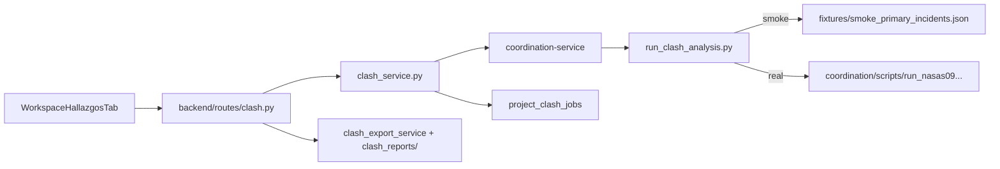

# Mapa de archivos y carpetas — Detección de clashes (Dupla)

Guía de referencia para revisión técnica. Documenta dónde vive cada pieza del flujo de clashes: UI, API, microservicio, persistencia, PDFs, motor geométrico y datos históricos.

**Fecha:** 14 de junio de 2026

---

## Flujo general (de punta a punta)



---

## 1. Microservicio de coordinación (motor de jobs)

**Carpeta principal:** `coordination-service/`

| Archivo | Qué hace |
|---------|----------|
| `coordination-service/main.py` | API FastAPI: `POST /jobs/clash-analysis`, `GET /jobs/{id}`, `GET /health` |
| `coordination-service/worker.py` | Worker RQ que consume la cola `dupla_coordination` |
| `coordination-service/tasks/run_clash.py` | Entry point del job en la cola |
| `coordination-service/wrapper/run_clash_analysis.py` | **Punto clave:** decide smoke vs. runner real |
| `coordination-service/adapters/manifest.py` | Staging de DWGs por disciplina + registro de niveles |
| `coordination-service/adapters/report_mapper.py` | Convierte `primary_incidents.json` → `StructuralAnalysisReport` (UI) |
| `coordination-service/adapters/dupla_reports.py` | Genera artefactos markdown/PDF del análisis |
| `coordination-service/fixtures/smoke_primary_incidents.json` | **Datos simulados** cuando `COORDINATION_SMOKE_MODE=true` |
| `coordination-service/Dockerfile` | Imagen del servicio |

**Config Docker:** `docker-compose.yml` — servicios `coordination-service` y `coordination-worker` (puerto **8002**), con `COORDINATION_SMOKE_MODE: "true"` por defecto.

### Evidencia: modo simulado vs. real

```147:160:coordination-service/wrapper/run_clash_analysis.py
    smoke_mode = os.getenv("COORDINATION_SMOKE_MODE", "").lower() in ("1", "true", "yes")
    ...
    if smoke_mode:
        primary = _smoke_primary_incidents(profile_slug, project_name, file_entries)
        context = None
    else:
        _invoke_runner(
            inputs_dir=inputs_dir,
            registry_path=Path(staging["registry_path"]),
            output_dir=output_dir,
            include_disciplines=staging.get("include_disciplines") or None,
        )
```

```111:111:docker-compose.yml
      COORDINATION_SMOKE_MODE: "true"
```

---

## 2. Backend (orquestación + persistencia + PDFs)

**Carpeta principal:** `backend/app/`

### Rutas API

| Archivo | Endpoints |
|---------|-----------|
| `backend/app/routes/clash.py` | Toda la API de clashes bajo `/api/projects/{uuid}/...` |

**Endpoints relevantes:**

| Método | Ruta | Descripción |
|--------|------|-------------|
| GET | `/api/projects/{uuid}/coordination/inventory` | Pre-flight (archivos + disciplinas) |
| GET | `/api/projects/{uuid}/coordination/folders` | Carpetas para el picker |
| POST | `/api/projects/{uuid}/clash/jobs` | Encolar análisis |
| GET | `/api/projects/{uuid}/clash/jobs/latest` | Estado del último job |
| GET | `/api/projects/{uuid}/structural-analysis-report` | Informe para la pestaña Hallazgos |
| GET | `/api/projects/{uuid}/clash/jobs/latest/exports/technical.pdf` | PDF técnico |
| GET | `/api/projects/{uuid}/clash/jobs/latest/exports/human.pdf` | PDF para arquitecto |
| GET | `/api/projects/{uuid}/clash/jobs/{job_id}/exports/technical.pdf` | PDF técnico por job |
| GET | `/api/projects/{uuid}/clash/jobs/{job_id}/exports/human.pdf` | PDF humano por job |

**Registro del router:** `backend/app/main.py` (`clash.router`).

### Servicios

| Archivo | Qué hace |
|---------|----------|
| `backend/app/services/clash_service.py` | **Orquestador principal:** valida DWG, sube archivos al coordination-service, polling, guarda resultado |
| `backend/app/services/clash_export_service.py` | Exportación PDF (técnico y humano) |

### Generación de PDFs

**Carpeta:** `backend/app/services/clash_reports/`

| Archivo | Rol |
|---------|-----|
| `normalize.py` | Normaliza incidentes del motor |
| `formatting.py` | Severidad, aliases, zoom commands |
| `data.py` | Datos auxiliares del informe |
| `technical_pdf.py` | PDF técnico |
| `human_pdf.py` | PDF para arquitecto |
| `pdf_base.py` | Base compartida |
| `__init__.py` | Paquete |

### Modelo y migraciones DB

| Archivo | Rol |
|---------|-----|
| `backend/app/models/project_clash_job.py` | Tabla `project_clash_jobs` (job_id, status, result JSONB, export metadata) |
| `backend/alembic/versions/031_project_clash_jobs.py` | Creación de la tabla |
| `backend/alembic/versions/032_clash_job_export_metadata.py` | Metadatos de exportación |

### Configuración y dominio

| Archivo | Rol |
|---------|-----|
| `backend/app/config.py` | `COORDINATION_URL` (default `http://coordination-service:8000`) |
| `backend/app/domain/file_discipline.py` | Buckets de disciplina usados en inventario de coordinación |

### Scripts de utilidad

| Archivo | Rol |
|---------|-----|
| `backend/scripts/generate_sample_clash_pdfs.py` | Genera PDFs de ejemplo |
| `backend/scripts/generate_tortuga_verification_pdfs.py` | PDFs de verificación TORTUGA |

### Tests

| Archivo | Qué prueba |
|---------|------------|
| `backend/tests/test_clash_report_normalize.py` | Normalización de incidentes |
| `backend/tests/test_clash_report_formatting.py` | Formato del informe |
| `backend/tests/test_clash_exports.py` | Generación de PDFs |

---

## 3. Frontend (UI pestaña Hallazgos)

**Carpeta principal:** `frontend/src/`

| Archivo | Rol |
|---------|-----|
| `frontend/src/components/project-workspace/tabs/WorkspaceHallazgosTab.tsx` | **UI principal** de clashes + hallazgos manuales |
| `frontend/src/hooks/useStructuralAnalysisJob.ts` | Hook: enqueue, polling, report |
| `frontend/src/api/structuralAnalysis.ts` | Cliente HTTP hacia backend |
| `frontend/src/types/structuralAnalysisReport.ts` | Tipos del informe |
| `frontend/src/types/clashJob.ts` | Tipos del job |
| `frontend/src/constants/coordinationProfiles.ts` | Perfiles (`tortuga_c40`, `serena18`, `nasas09`, etc.) |
| `frontend/src/pages/ProjectWorkspacePage.tsx` | Monta la pestaña `hallazgos` |
| `frontend/src/constants/projectWorkspaceTabs.ts` | Define pestaña `hallazgos` |
| `frontend/src/constants/projectWorkspaceHubCards.ts` | Tarjeta del hub |
| `frontend/src/components/project-workspace/WorkspaceTabsLayout.tsx` | Icono pestaña |
| `frontend/src/components/project-workspace/ProjectWorkspaceHub.tsx` | Acceso desde hub |
| `frontend/src/components/project-workspace/ProjectWorkspaceDashboard.tsx` | Acceso desde dashboard |

### Tutoriales y referencia UI

| Archivo | Rol |
|---------|-----|
| `frontend/src/constants/tutorialesToc.ts` | Entrada "Pestaña Hallazgos" |
| `frontend/src/constants/tutorialsGuidesFilter.ts` | Filtro de guías |
| `frontend/src/components/tutorials/TutorialesReference.tsx` | Documentación in-app |
| `frontend/src/lib/productTours.ts` | Tour guiado del workspace |

### Hallazgos manuales (distinto del motor automático)

La misma pestaña **Hallazgos** mezcla clashes automáticos y hallazgos manuales:

| Archivo | Rol |
|---------|-----|
| `backend/app/models/project_technical_finding.py` | Modelo hallazgos manuales |
| `backend/app/routes/project_lifecycle.py` | `GET/POST .../technical-findings` |
| `backend/app/services/project_lifecycle_service.py` | CRUD hallazgos manuales |
| `backend/app/schemas/project_lifecycle.py` | `TechnicalFindingCreateRequest`, `TechnicalFindingResponse` |

### Mock no usado (revisar / eliminar)

| Archivo | Nota |
|---------|------|
| `frontend/src/data/mockStructuralAnalysisReport.ts` | Demo antiguo; **no está importado** en ningún sitio |

---

## 4. Motor geométrico (fuera del microservicio)

**Importante para el revisor:** el algoritmo 2.5D **no vive en `coordination-service/`**. Se invoca por subprocess:

```
{DUPLA_ROOT}/coordination/scripts/run_nasas09_project_coordination.py
```

Ese script **no está en el repositorio** (la carpeta `coordination/` en raíz está vacía o es esqueleto). Sin él, solo funciona el modo smoke.

### Registros de niveles por proyecto (input del motor)

| Ubicación |
|-----------|
| `aps_integration/NASAS 09/coordination/sample_project_levels.json` |
| `ARQUITECTURA/SERENA 18/coordination/serena18_project_levels.json` |
| `ARQUITECTURA/TORTUGA C40/coordination/tortuga_c40_project_levels.json` |
| `repositorios/SERENA 18/coordination/serena18_project_levels.json` |
| `repositorios/SERENA 18/coordination/packages/` |
| `repositorios/TORTUGA C40/coordination/tortuga_c40_project_levels.json` |
| `repositorios/TORTUGA C40/coordination/packages/` |

### Script offline de preparación

| Archivo | Rol |
|---------|-----|
| `ARQUITECTURA/prepare_clash_runs.py` | Prepara cohortes/manifiestos para corridas offline |

### APS (extracción DWG para clashes reales)

| Carpeta | Rol |
|---------|-----|
| `processor/aps_integration/` | OAuth, OSS, Model Derivative (usado con `--dwg-via-aps`) |
| `processor/aps_integration/da_manager.py` | Design Automation (tooling) |
| `aps_integration/` | Integración APS adicional + outputs de coordinación NASAS |
| `aps_integration/NASAS 09/outputs/coordination/` | Informes clash históricos NASAS |

---

## 5. Datos de salida / corridas históricas (referencia, no código)

**Carpeta:** `analysis_output/` — resultados de corridas reales/offline

### Corridas por paquete

| Carpeta | Contenido típico |
|---------|------------------|
| `analysis_output/tortuga_c40_package_run/` | `primary_incidents.json`, `coordination_report_context.json` |
| `analysis_output/serena18_package_run/` | Idem SERENA 18 |
| `analysis_output/nasas09_verification_run/` | Verificación NASAS 09 |
| `analysis_output/tortuga_c40_verification_run/` | Verificación TORTUGA |
| `analysis_output/serena18_verification_run/` | Verificación SERENA |

### Corridas Analysis_Clashes_*

| Carpeta | Proyecto |
|---------|----------|
| `analysis_output/Analysis_Clashes_NASAS09_*` | NASAS 09 |
| `analysis_output/Analysis_Clashes_SERENA18_*` | SERENA 18 |
| `analysis_output/Analysis_Clashes_TORTUGAC40_*` | TORTUGA C40 |

Archivos frecuentes: `clash_project_report.json`, `layer_clashes.csv`, `clash_element_links.json`.

### Otros

| Carpeta | Nota |
|---------|------|
| `analysis_output/nasas09_smoke/` | Corrida smoke |
| `analysis_output/nasas09_smoke_synth/` | Smoke sintético |
| `analysis_output/dump/` | `visual_clashes.json`, `native_clashes.json` |

---

## 6. Integración con pliego (hallazgos → GA-FO)

| Archivo | Rol |
|---------|-----|
| `backend/app/services/pliego_business_service.py` | Incorpora hallazgos técnicos al pliego (restricciones, riesgos) |

---

## 7. Documentación relacionada

| Archivo | Contenido |
|---------|-----------|
| `docs/INFORME_ESTADO_PROYECTO.md` | Audit completo del proyecto (secciones 7 y 9: clashes) |
| `docs/MAPA_CLASHES.md` | Este documento |

---

## 8. Qué debe saber el revisor

| Tema | Dónde mirar |
|------|-------------|
| ¿Está simulado o es real? | `docker-compose.yml` → `COORDINATION_SMOKE_MODE` + `run_clash_analysis.py` líneas 147–160 |
| Punto de entrada UI | `WorkspaceHallazgosTab.tsx` + `useStructuralAnalysisJob.ts` |
| Punto de entrada API | `backend/app/routes/clash.py` |
| Orquestación backend | `backend/app/services/clash_service.py` |
| Microservicio | `coordination-service/` completo |
| Persistencia | `project_clash_job.py` + migraciones 031/032 |
| PDFs | `clash_export_service.py` + `clash_reports/` |
| Tests | `backend/tests/test_clash_*.py` |
| Motor geométrico real | **Ausente del repo** — buscar `run_nasas09_project_coordination.py` |
| Datos de prueba smoke | `coordination-service/fixtures/smoke_primary_incidents.json` |
| Hallazgos manuales | `project_technical_finding.py` + rutas en `project_lifecycle.py` |

---

## 9. Orden sugerido para la revisión

1. `frontend/src/components/project-workspace/tabs/WorkspaceHallazgosTab.tsx` — qué ve el usuario
2. `frontend/src/api/structuralAnalysis.ts` — qué llama
3. `frontend/src/hooks/useStructuralAnalysisJob.ts` — polling y estado
4. `backend/app/routes/clash.py` — contrato API
5. `backend/app/services/clash_service.py` — lógica de negocio
6. `coordination-service/main.py` — API del microservicio
7. `coordination-service/wrapper/run_clash_analysis.py` — smoke vs. real
8. `coordination-service/adapters/report_mapper.py` — formato del informe
9. `backend/app/services/clash_reports/` — PDFs
10. `backend/tests/test_clash_*.py` — tests existentes
11. `analysis_output/tortuga_c40_package_run/primary_incidents.json` — ejemplo de salida real offline

---

## 10. Variables de entorno relevantes

| Variable | Servicio | Efecto |
|----------|----------|--------|
| `COORDINATION_URL` | Backend | URL del microservicio (default `http://coordination-service:8000`) |
| `COORDINATION_SMOKE_MODE` | Coordination | `"true"` → fixtures simulados; `"false"` → runner real |
| `DUPLA_ROOT` | Coordination | Ruta al repo con el script runner |
| `COORDINATION_OUTPUT_ROOT` | Coordination | Directorio de salida de jobs |
| `REDIS_URL` | Coordination | Cola RQ `dupla_coordination` |
| `CLIENT_ID` / `CLIENT_SECRET` | Backend + Processor | APS para extracción DWG en modo real |

---

## 11. Resumen por capa

| Capa | Carpeta / archivo clave | Estado |
|------|-------------------------|--------|
| UI | `frontend/.../WorkspaceHallazgosTab.tsx` | Real |
| API cliente | `frontend/src/api/structuralAnalysis.ts` | Real |
| API servidor | `backend/app/routes/clash.py` | Real |
| Orquestación | `backend/app/services/clash_service.py` | Real |
| Microservicio | `coordination-service/` | Real (smoke por defecto) |
| Motor 2.5D | `coordination/scripts/run_nasas09...` | **Ausente del repo** |
| Persistencia | `project_clash_jobs` | Real |
| PDFs | `clash_reports/` | Real |
| Tests | `backend/tests/test_clash_*.py` | Parcial (sin E2E detección) |

---

*Documento generado para revisión entre programadores. Ver también `docs/INFORME_ESTADO_PROYECTO.md` para el estado global del proyecto.*
