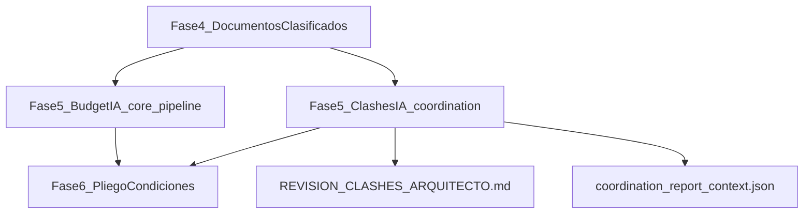

# Instructivo de Integración de Clashes al Pipeline Central

Fecha: 22-05-2026  
Audiencia: Programador de seguimiento (reunión Dupla 22-05-2026)  
Objetivo: Integrar el motor de clashes de `coordination/` dentro de la Fase 5 del flujo principal de Dupla, manteniendo defensibilidad técnica y trazabilidad operativa.

---

## 1) Resumen ejecutivo

Dupla hoy tiene dos tracks productivos:

- Presupuesto (pipeline central): `dupla_run_full_analysis_local.py` + `core/pipeline.py`
- Coordinación/clashes (pipeline paralelo): `coordination/` + `coordination/scripts/run_nasas09_project_coordination.py`

El motor de clashes ya está maduro para uso operativo (selección -> audit -> schedule -> extracción -> clash -> reportes), pero aún no está acoplado al flujo principal de Fase 5.

### Estado actual por proyecto

| Proyecto | Estado V2 | Lectura |
|---|---|---|
| TORTUGA C40 | 16 incidencias primarias | Clashes defendibles (SLAB/SLAB) |
| SERENA 18 | 0 incidencias primarias | V1 era mayormente ruido de anotación (MARCO/PROYECCION) |
| NASAS 09 | 0 incidencias primarias | Consistente con dataset actual y filtros de calidad |

---

## 2) Posición en flujo principal (Fase 5)



Punto clave: la salida de coordinación se incorpora al pliego técnico (Fase 6), no como reemplazo del budget pipeline sino como capa complementaria de riesgos y conflictos entre disciplinas.

---

## 3) API y entradas recomendadas

### Entrada técnica estable (hoy)

- Script principal: `coordination/scripts/run_nasas09_project_coordination.py`
- Perfil recomendado: `--analysis-profile fast_compare --stage full`

### Superficie de configuración por proyecto

- Niveles: `{project_root}/coordination/{slug}_project_levels.json`
- Reglas de capas: `config/layer_rules/{slug}.yaml`
- Matriz de roles: `config/clash_role_matrix/{slug}.yaml`
- Tolerancias: `config/tolerances/{slug}.yaml`
- Cohort manual (opcional): `cohort_manifest.json`
- Alineación manual (opcional): `alignment_manifest.json`

---

## 4) Cómo integrar un proyecto nuevo (checklist operativo)

1. Crear o validar `project_levels.json` (niveles + patrones de vista).  
2. Crear `layer_rules/{slug}.yaml` según capas reales del proyecto.  
3. Crear `clash_role_matrix/{slug}.yaml` (overrides mínimos; preferir heredar default).  
4. Ajustar `tolerances/{slug}.yaml` solo si hay falsos positivos/negativos sistemáticos.  
5. Definir `cohort_manifest.json` con DWG comparables ARQ/EST.  
6. Ejecutar corrida `fast_compare full`.  
7. Validar telemetría antes de publicar resultados:  
   - `pair_schedule_diagnostics.csv`  
   - `layer_role_coverage.csv`  
   - `coordinate_audit.json`

---

## 5) Wiring técnico en pipeline central

## Opción A (rápida, bajo riesgo): subprocess

Desde `dupla_run_full_analysis_local.py`, después de clasificación documental/fuentes CAD, lanzar el runner de coordinación como proceso independiente, pasando root, registry y output folder del proyecto.

Ventaja: menor acoplamiento inmediato.  
Riesgo: menos reutilización de objetos internos.

## Opción B (recomendada mediano plazo): wrapper Python

Crear una función puente, por ejemplo:

```python
def run_clash_analysis(project_manifest, outputs_dir) -> dict:
    ...
```

que traduzca el `ProjectManifest` del pipeline central a argumentos del runner de coordinación y devuelva paths a artefactos de salida clave.

Ventaja: integración limpia para Fase 5/Fase 6.

---

## 6) Artefactos obligatorios a consumir aguas abajo

| Artefacto | Archivo | Uso |
|---|---|---|
| Incidencias primarias | `primary_incidents.json` | Riesgos técnicos de coordinación para Fase 6 |
| Contexto técnico | `coordination_report_context.json` | Resumen técnico estructurado del run |
| Reporte arquitecto por proyecto | `REVISION_CLASHES_ARQUITECTO_{PROJECT}.md` | Revisión manual de campo en AutoCAD |
| Reporte general consolidado | `REVISION_CLASHES_ARQUITECTO.md` | Vista unificada de proyectos analizados |
| Telemetría diagnóstica | `pair_schedule_diagnostics.csv`, `layer_role_coverage.csv` | QA de comparabilidad y semántica de capas |

---

## 7) Lo que ya quedó implementado en esta sesión

1. **TORTUGA**: reglas de capas ampliadas y matriz de roles corregida para SLAB/SLAB y SLAB/BEAM.  
2. **SERENA**: scheduling robusto para cohort curado con `trust_cohort_bands`.  
3. **Reporting**:
   - reporte individual automático por proyecto (`REVISION_CLASHES_ARQUITECTO_{PROJECT}.md`)
   - reporte general consolidado automático (`REVISION_CLASHES_ARQUITECTO.md`)

---

## 8) Deuda técnica priorizada (auditada)

1. Renombrar `run_nasas09_project_coordination.py` a un entrypoint genérico (`run_clash_coordination.py`) conservando backward compatibility.  
2. Desacoplar heurísticas NASAS-centric en `core/nasas_paths.py` hacia utilidades neutrales de proyecto.  
3. Agregar `--project-manifest` para parametrización homogénea con `pipeline/project_manifest.py`.  
4. Conectar formalmente salidas de clashes al pliego de condiciones (Fase 6) en `core/pipeline.py`.

---

## 9) Criterio de aceptación para la integración

Se considera integrada cuando el pipeline principal:

- ejecuta coordinación automáticamente en Fase 5 para proyectos habilitados,
- produce artefactos de clash junto a outputs de presupuesto,
- expone `REVISION_CLASHES_ARQUITECTO.md` consolidado para revisión manual,
- y serializa en output final un puntero explícito al `coordination_report_context.json`.

