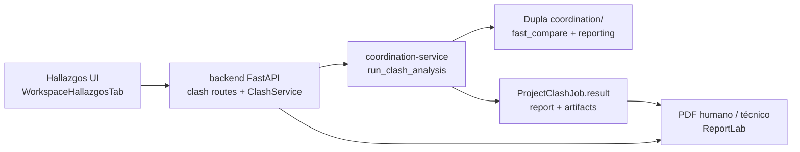

# Instructivo de Integración de Clashes — Reunión Dupla 22-05-2026

Fecha: 22-05-2026 (actualizado tras integración UI + PDF)  
Audiencia: Equipo Dupla (reunión de seguimiento)  
Objetivo: Integrar el motor de clashes de `coordination/` en la app web (Fase 5) y dejar trazabilidad operativa para revisión manual en AutoCAD.

**Repos involucrados**

| Repo / carpeta | Rol | Branch de trabajo |
|---|---|---|
| `Dupla/` (motor) | Detección 2.5D, reporting MD/JSON | `refactor-clash-segmentado` |
| `dupla-feat-budget-analysis-pricing/` (app web) | UI Hallazgos, jobs, PDFs | `feat-budget-analysis-pricing` (local) |

App en Docker: `http://localhost:5173` · API: `http://localhost:8000/docs`

---

## 1) Resumen ejecutivo para la reunión

Dupla tiene **dos tracks** que ya convergen en la pestaña **Hallazgos**:

- **Presupuesto** — pipeline central (`core/pipeline.py`, processor APS).
- **Coordinación / clashes** — motor `coordination/` + servicio `coordination-service` en Docker.

**Lo que ya funciona end-to-end (demo TEST_01):**

1. Subir DWG a una carpeta del proyecto (p. ej. `TEST_01`).
2. En **Hallazgos**, lanzar análisis de clashes (job async vía Redis).
3. Ver estado del job, resumen y artefactos en `job.result`.
4. Descargar **PDF humano** (guía de revisión para arquitecto) y **PDF técnico** (auditoría).
5. El motor Dupla genera en paralelo `REVISION_CLASHES_ARQUITECTO_*.md`, `primary_incidents.json` y `coordination_report_context.json`.

**Mensaje clave para el equipo:** el markdown de revisión ya tenía capas, centros y comandos `Z W`; los PDFs ahora consumen las **mismas fuentes** gracias a un adaptador de normalización (`normalize_incident_for_reports`).

---

## 2) Estado por proyecto (motor Dupla)

| Proyecto | Incidencias primarias | Lectura |
|---|---|---|
| TORTUGA C40 | 16 | Clashes defendibles (p. ej. SOLAR/SOLAR, PLAFON/SOLAR) |
| SERENA 18 | 53 en corrida real (`serena18_analysis_06`) | Geometría primaria; V1 tenía ruido de anotación |
| NASAS 09 | 0 | Consistente con filtros de calidad actuales |

---

## 3) Arquitectura integrada (app web + motor)

**Artefactos en `job.result.artifacts`:**

| Clave | Contenido |
|---|---|
| `primary_incidents` | JSON incidencias + geometría |
| `coordination_context` | Tarjetas enriquecidas (`layer_pair`, `location_short`, …) |
| `pair_schedule` | Pares programados |
| `revision_md` | Markdown arquitecto (fallback en normalizador) |
| `analyzed_documents` | Inventario DWG de la carpeta |

---

## 4) PDFs exportables (app web)

Rutas API:

- `GET .../clash/jobs/latest/exports/human.pdf`
- `GET .../clash/jobs/latest/exports/technical.pdf`

**PDF humano** — Guía de revisión manual: tarjetas por incidencia, comando `Z W`, bitácora, leyenda de alias.

**PDF técnico** — Auditoría: metadatos de corrida, pares programados, métricas, índice compacto, detalle por incidencia con **provenance** (`layers_source`, `center_source`, …), advertencias de calidad.

### Correcciones recientes (importante para demo)

1. **Datos en PDF** — Antes mostraba `no disponible` aunque el MD tuviera capas/centro/`Z W`. Causa: el builder leía `enriched.layers` como string; el contexto usa `layer_pair` y listas. Solución: `normalize_incident_for_reports()` con cadena de fallback (primary → context → revision_md).
2. **PDF técnico — layout** — Índice de incidencias en **landscape**, columnas reducidas (sin Centro/Z en índice; van al detalle), `Paragraph` con wrap, alias en dos líneas.
3. **PDF técnico — inventario** — Se eliminó la sección **Inventario analizado** del PDF final (solo queda leyenda de alias en apéndice).

**Metadata de job:** migración `032_clash_job_export_metadata` — `folder_id`, `cad_fingerprint`, `run_sequence`, `triggered_by_user_id`.

---

## 5) Cómo probar en la reunión (5 min)

1. `docker compose up --build` en la app web.
2. Proyecto demo **Tutorial · Workspace Dupla**, carpeta **TEST_01**.
3. Hallazgos → **Analizar clashes** → esperar `completed`.
4. Descargar PDF humano y técnico; comparar con `revision_md` del job.
5. Verificar en PDF técnico: capas (p. ej. SOLAR), centro XY, `Z W`, y filas `*_source` en detalle.

**Smoke mode:** `COORDINATION_SMOKE_MODE=true` en docker-compose usa fixture enriquecido con geometría TORTUGA-like.

---

## 6) Motor Dupla — entrada técnica estable

- Script: `coordination/scripts/run_nasas09_project_coordination.py` (renombrado pendiente).
- Perfil: `--analysis-profile fast_compare --stage full`
- Config por proyecto: `config/layer_rules/{slug}.yaml`, `clash_role_matrix`, `tolerances`, `{slug}_project_levels.json`

---

## 7) Lo implementado en el motor (`Dupla/`)

1. TORTUGA: reglas de capas + matriz de roles (SLAB/SLAB, SLAB/BEAM).
2. SERENA: scheduling con `trust_cohort_bands`.
3. Reporting: `REVISION_CLASHES_ARQUITECTO_{PROJECT}.md` + consolidado.
4. Perfiles de lector ampliados (arquitectura, eléctrico, sanitario, mecánico) en `coordination/reporting/reporting.py`.

---

## 8) Lo implementado en la app web (`dupla-feat-budget-analysis-pricing/`)

| Área | Qué hay |
|---|---|
| Backend | `ProjectClashJob`, `ClashService`, rutas clash, export PDF |
| coordination-service | Wrapper `run_clash_analysis`, `dupla_reports.py`, smoke fixture |
| Frontend | `WorkspaceHallazgosTab` — job poll, botones PDF |
| PDF | `backend/app/services/clash_reports/` — `normalize.py`, `human_pdf.py`, `technical_pdf.py` |
| Tests | `test_clash_exports.py`, `test_clash_report_normalize.py` (18 tests OK) |

---

## 9) Deuda técnica priorizada

1. Renombrar runner NASAS → entrypoint genérico (`run_clash_coordination.py`).
2. Conectar salidas de clash al pliego Fase 6 en `core/pipeline.py`.
3. Git remoto formal para monorepo app web (hoy carpeta local sin `.git` remoto configurado).
4. Regenerar nginx upstream tras rebuild backend (ver `frontend/nginx.conf` con resolver Docker).
5. Opcional: fuentes DejaVu embebidas en imagen Docker para acentos estables en PDF.

---

## 10) Criterio de aceptación integración

- [x] UI Hallazgos lanza job de clashes por carpeta.
- [x] Artefactos MD/JSON + PDF en job completado.
- [x] PDF humano usable para revisión AutoCAD (capas, centro, `Z W`).
- [x] PDF técnico con provenance y sin solapamiento en índice.
- [ ] Pipeline central Fase 5 ejecuta clashes automáticamente (sin botón manual).
- [ ] Pliego Fase 6 consume `coordination_report_context.json`.

---

## 11) Preguntas útiles para la reunión

1. ¿Qué proyectos entran en piloto de clashes en producción (TORTUGA, SERENA, otros)?
2. ¿Quién es el revisor previsto del PDF humano (arquitecto vs coordinador)?
3. ¿Priorizamos acoplar Fase 5 central o pulir UX Hallazgos (filtros, histórico de corridas)?
4. ¿Necesitamos export CSV además de PDF para bitácora?

---

## Referencias rápidas

- Plan integración UI: `.cursor/plans/integración_clashes_ui_e4b078ff.plan.md`
- Módulo reporting: `coordination/reporting/revision_report.py`
- Normalizador PDF: `backend/app/services/clash_reports/normalize.py`
- Sample PDFs: `backend/var/sample_pdfs/TEST_01_*.pdf` (generar con `scripts/generate_sample_clash_pdfs.py`)
